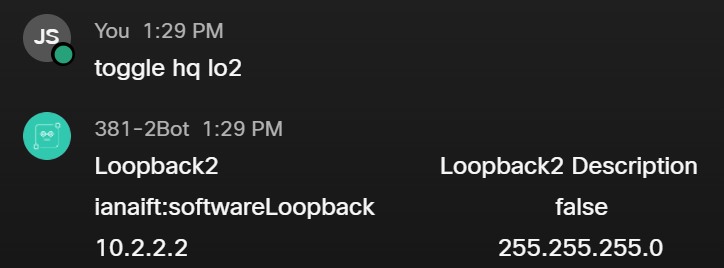

# CNIT-381-Final
***Purpose:*** 
This is the repoitory for R. Berends, J. Sletten, S. Solsvik final project for CNIT 381 Network Programmability and Automation.

# Project description

Create a chatbot that can administer a network using Paramiko/Netmiko, Netconf/Restconf, and Ansible.

***Problem:***
A branch of a Bank can only get an ADSL connection to the internet. They need to use a VPN tunnel for secure access to the HQ to access client data.
Becasue of the connection the branch has their public IP address changes every 3 hours dropping their VPN connection. 
Part of the chatbots purpose it to notify the IT administrator at the brach that a new IP address has been assigned and to then automatically change the VPN configuration to use this new IP address to regain secure VPN access to HQ.
.
# Tutorials
***NETCONF Skill Tutorial: Interface Toggler***

Usage: toggle [router] [interface]

The toggle command, when given a router and interface to act on, will enable a disabled interface, or disable an enabled interface.
It requires the name of the router ("hq" or "branch" for this project) and the abreviated name of the interface you'd like to toggle (lo2, gb1, etc.)
If either of these arguments are invalid or missing, the bot will let you know.
After toggling the interface, the chat bot will print some information about the interface, including it's current state, to the message thread.

***Ansible Skills Tutorial: Test the vpn config, and update the vpn config***

Usage: vpn test

This command will allow an anisble playbook to update the interface with a new ip address. The playbook then sends a ping to test that configuration change and depending on whether that fails or not will depend on whether the VPN information will need to be updated or not.

Usage: update vpn

This command will update the vpn configuration of the HQ router with the new IP addressing information from the other ansible skill.

