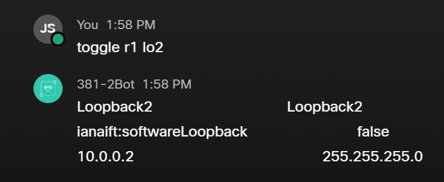

# CNIT-381-Final
***Purpose:*** 
This is the repoitory for R. Berends, J. Sletten, S. Solsvik final project for CNIT 381 Network Programmability and Automation.

# Project descriptoion

Create a chatbot that can administer a network using Paramiko/Netmiko, Netconf/Restconf, and Ansible.

***Problem:***
A branch of a Bank can only get an ADSL connection to the internet. They need to use a VPN tunnel for secure access to the HQ to access client data.
Becasue of the connection the branch has their public IP address changes every 3 hours dropping their VPN connection. 
Part of the chatbots purpose it to notify the IT administrator at the brach that a new IP address has been assigned and to then automatically change the VPN configuration to use this new IP address to regain secure VPN access to HQ.
.
# Tutorials
***NETCONF Skill Tutorial: Interface Toggler***

Usage: toggle [router] [interface]

The toggle command, when given a router and interface to act on, will enable a disabled interface, or disable an enabled interface.
it requires the name of the router (r1 or r2 for this project) and the abreviated name of the interface you'd like to toggle (lo2, gb1, etc.)
If either of these arguments are missing, the command will default to targeting Loopback1 on router one.

